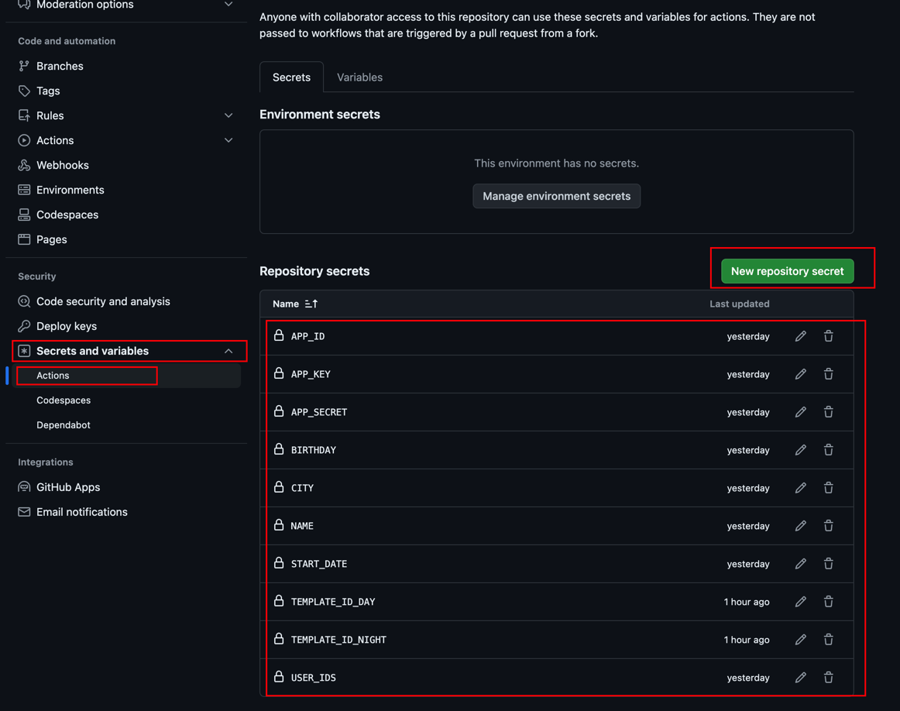
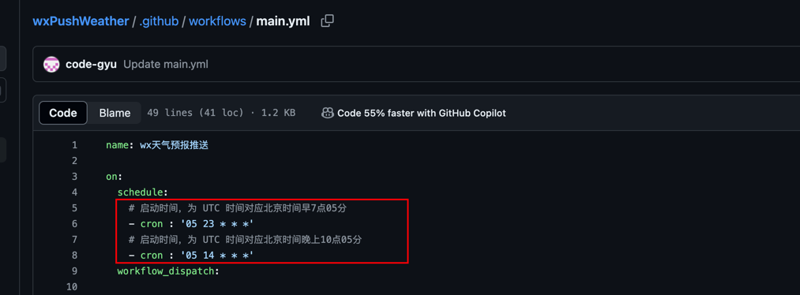

<div align="center">

<h1 align="center">
wxPushWeather
</h1>

[](https://github.com/code-gyu/wxPushWeather/stargazers)
[](https://github.com/code-gyu/wxPushWeather/network/members)
[](https://github.com/code-gyu/wxPushWeather/issues)
[](https://github.com/code-gyu/wxPushWeather/graphs/contributors)
[](https://github.com/code-gyu/wxPushWeather/blob/master/LICENSE)

</div>

<br>

**wxPushWeather 是一个基于微信测试号的自动化消息推送脚本，专为情侣设计的早晚问候系统，通过 GitHub Actions 实现无服务器的免费天气推送服务。**

**原理：使用 GitHub Actions 功能运行 Python 程序，实现无服务器的自动化任务，如每日天气推送、纪念日提醒等。**

如果这个项目对您有帮助，请右上角点个 star✨ 支持我们，谢谢！

如有任何问题，欢迎联系：545113081@qq.com

作者：**CodeGyu** 全网同名，转载请注明出处

<h3 style="color: red;">重要通知：</h3>

**微信团队于2023年5月4日晚12点起，不再支持【文字自定义颜色】功能**

---

## 🌟 项目特点

- **完全免费**：基于 GitHub Actions 实现，无需服务器
- **自动化推送**：每天早晚定时推送天气和温馨问候
- **多用户支持**：可同时向多个用户推送消息
- **个性化定制**：支持自定义模板和参数
- **丰富功能**：支持生日提醒、纪念日计算、春节倒计时等
- **智能文案**：集成彩虹屁API，每日不同温馨话语
- **准确天气**：使用和风天气API，提供准确的天气信息

## 📋 功能列表

- ✅ 每天早上推送当日天气信息
- ✅ 每天晚上推送次日天气预报
- ✅ 支持多个收件人
- ✅ 生日自动提醒
- ✅ 恋爱天数计算
- ✅ 春节倒计时
- ✅ 每日不同温馨文案
- ✅ 自定义模板推送
- ✅ 解决微信测试号20字限制问题

## 📸 效果预览


## 🚀 部署指南

### 1. 申请微信公众号测试账号

1. 使用微信扫码进入[微信公众平台测试账号页面](https://mp.weixin.qq.com/debug/cgi-bin/sandbox?t=sandbox/login)
2. 获取以下信息：
   - `appID`（应用ID）
   - `appSecret`（应用密钥）

3. 让接收消息的人扫描二维码关注测试号，获取 `openId`（用户ID）

4. 新增测试模板，获取 `template_id`（模板ID）

模板内容示例：

**早上模板标题**：宝贝，早上好啊☀️
```
💓可爱的：{{name.DATA}} 
📅今天是：{{today.DATA}} 
🌍城市：{{city.DATA}} 
☁️今日天气：{{weather.DATA}} 
🌡️当前温度：{{now_temperature.DATA}} 
🌕今日最低温度：{{min_temperature.DATA}}
🌞今日最高温度：{{max_temperature.DATA}}  
❤️我们已经恋爱：{{love_date.DATA}}  
🎂距离你这个小笨蛋的生日还有：{{birthday.DATA}}  
🏮距离春节还有：{{diff_date1.DATA}}
🌄日出时间：{{sunrise.DATA}}
🌄日落时间：{{sunset.DATA}}
🌛夜间天气：{{textNight.DATA}}
☁️白天风向：{{windDirDay.DATA}}
☁️夜间风向：{{windDirNight.DATA}}
🐝风力等级：{{windScaleDay.DATA}}
💬{{note1.DATA}}{{note2.DATA}}{{note3.DATA}}{{note4.DATA}}{{note5.DATA}}
ʕ•̫͡•ʔ•̫͡•ཻʕ•̫͡•ʔ•͓͡•ʔʕ•̫͡•ʔ•̫͡•ཻʕ•̫͡•ʔ•͓͡•ʔʕ•̫͡•ʔ
```

**晚上模板标题**：宝贝，晚上好啊🌛
```
💓可爱的：{{name.DATA}} 
📅今天是：{{today.DATA}} 
🌍城市：{{city.DATA}} 
☁️明日天气：{{weather.DATA}} 
🌡️当前温度：{{now_temperature.DATA}} 
🌕明日最低温度：{{min_temperature.DATA}}
🌞明日最高温度：{{max_temperature.DATA}}  
❤️我们已经恋爱：{{love_date.DATA}}  
🎂距离你这个小笨蛋的生日还有：{{birthday.DATA}}  
🏮距离春节还有：{{diff_date1.DATA}}
🌄日出时间：{{sunrise.DATA}}
🌄日落时间：{{sunset.DATA}}
🌛夜间天气：{{textNight.DATA}}
☁️白天风向：{{windDirDay.DATA}}
☁️夜间风向：{{windDirNight.DATA}}
🐝风力等级：{{windScaleDay.DATA}}
💬{{note1.DATA}}{{note2.DATA}}{{note3.DATA}}{{note4.DATA}}{{note5.DATA}}
ʕ•̫͡•ʔ•̫͡•ཻʕ•̫͡•ʔ•͓͡•ʔʕ•̫͡•ʔ•̫͡•ཻʕ•̫͡•ʔ•͓͡•ʔʕ•̫͡•ʔ
```

### 2. 申请和风天气API密钥

访问[和风天气开发平台](https://dev.qweather.com/)注册账号并创建应用，获取免费的API密钥。

### 3. Fork本项目并配置

1. Fork本项目到您的GitHub账号下

2. 进入您Fork的项目，点击 `Settings` → `Secrets and variables` → `Actions` → `New repository secret`

3. 配置以下环境变量：

| 变量名 | 说明 | 示例 |
|--------|------|------|
| `START_DATE` | 恋爱开始日期 | "2021-03-14" |
| `APP_KEY` | 和风天气API密钥 | "your_qweather_key" |
| `BIRTHDAY` | 生日日期(MM-DD) | "02-02" |
| `APP_ID` | 微信测试号AppID | "your_wechat_app_id" |
| `APP_SECRET` | 微信测试号AppSecret | "your_wechat_app_secret" |
| `USER_IDS` | 用户ID(多个用;分隔) | "user1;user2" |
| `TEMPLATE_ID_DAY` | 白天模板ID | "your_day_template_id" |
| `TEMPLATE_ID_NIGHT` | 晚上模板ID | "your_night_template_id" |
| `NAME` | 昵称 | "宝贝" |
| `CITY` | 城市名称 | "北京" |



4. 进入 `Actions` → `wx天气预报推送` → `weather_report.yml`，可根据需要修改cron表达式的执行时间

默认推送时间：
- 早上7点05分（UTC时间23点05分）
- 晚上10点05分（UTC时间14点05分）



## 🛠 技术栈

- Python 3.x
- GitHub Actions（无服务器部署）
- 和风天气API
- 微信测试号API

## 📦 依赖库

- `requests` - HTTP请求库
- `wechatpy` - 微信公众号SDK
- `lunardate` - 农历日期计算
- `python-dotenv` - 环境变量加载
- `python-dateutil` - 日期处理

## 📄 许可证

本项目基于MIT许可证开源，详情请查看[LICENSE](LICENSE)文件。

## 💡 使用提示

1. 确保所有环境变量都正确配置
2. 检查GitHub Actions是否正常运行
3. 如遇到推送失败，请检查API密钥是否有效
4. 可根据需要自定义推送模板和时间

## 🤝 贡献

欢迎提交Issue和Pull Request来改进本项目！

## 📧 联系方式

如有任何问题，请联系：545113081@qq.com
